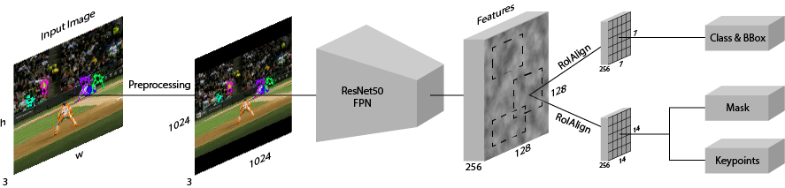
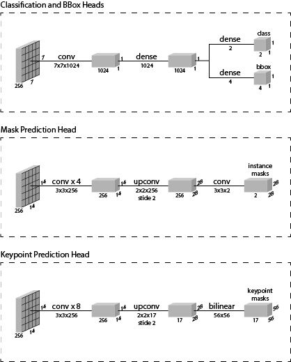
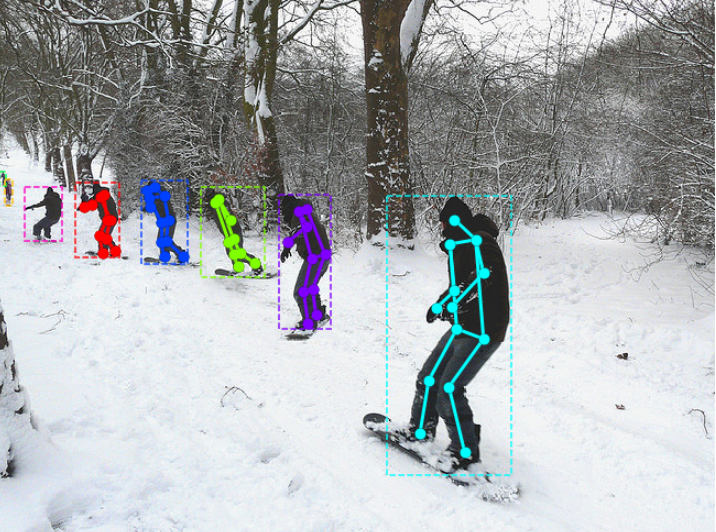
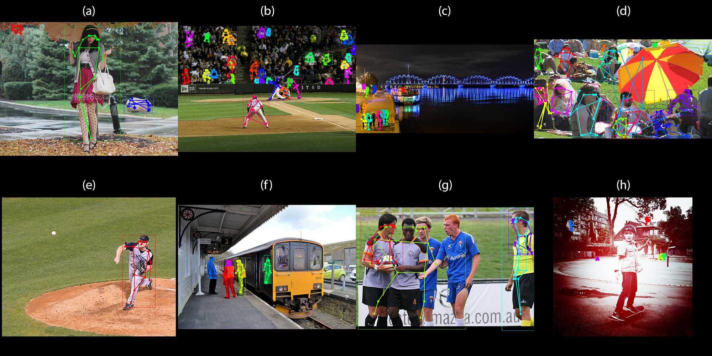
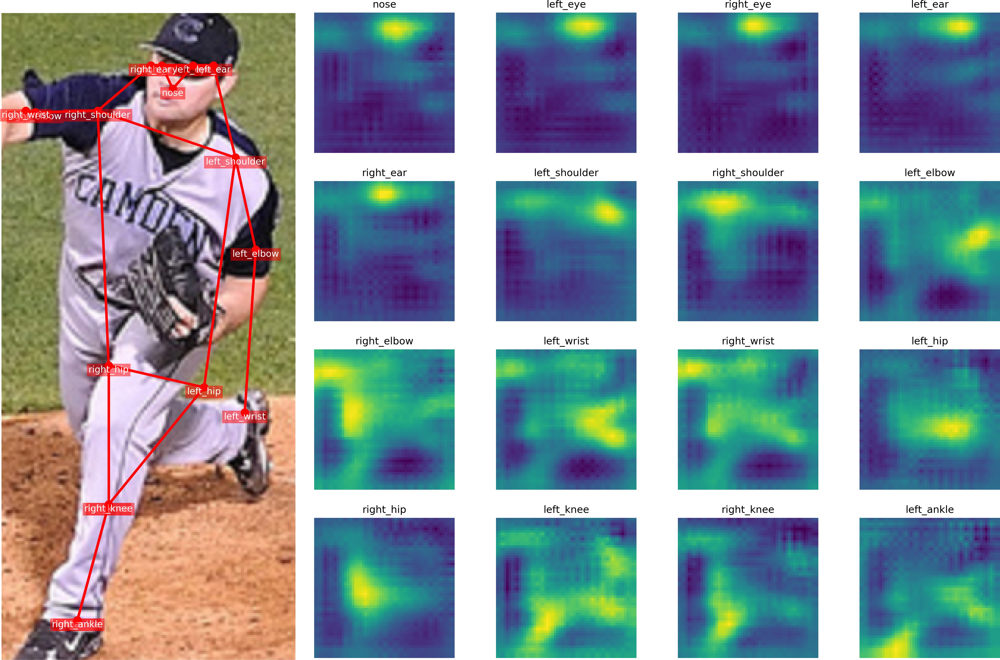
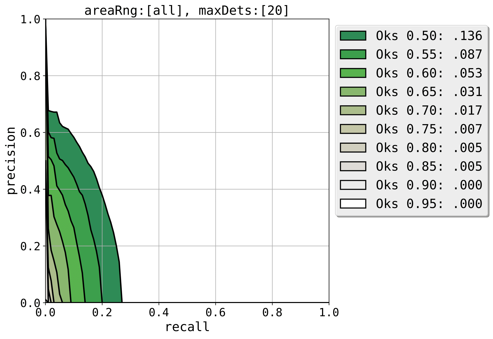
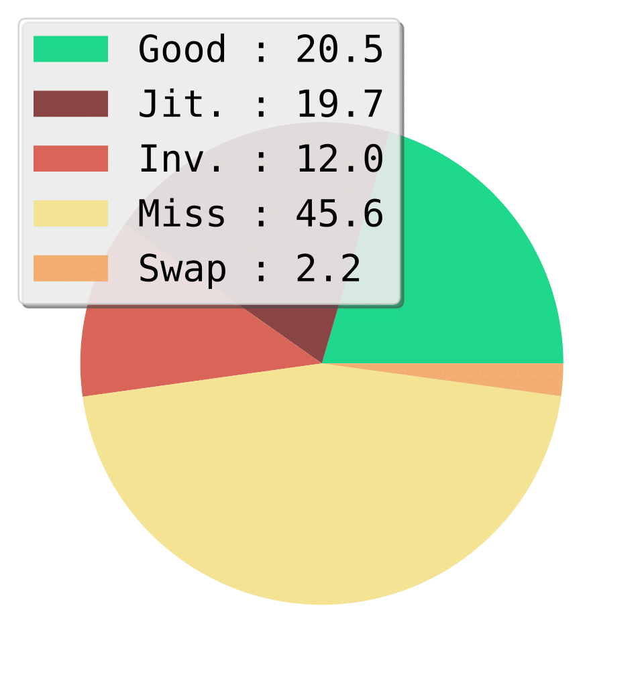
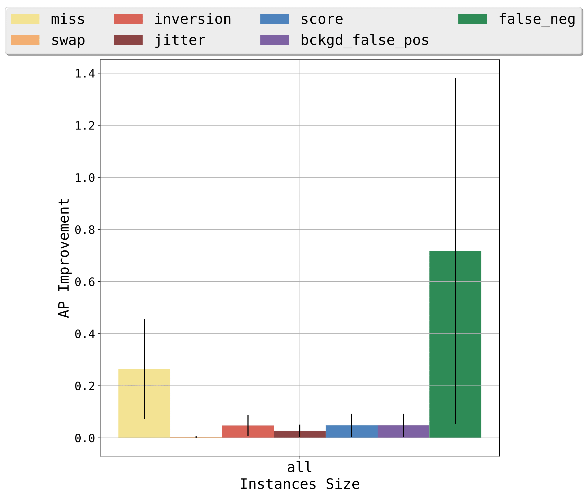
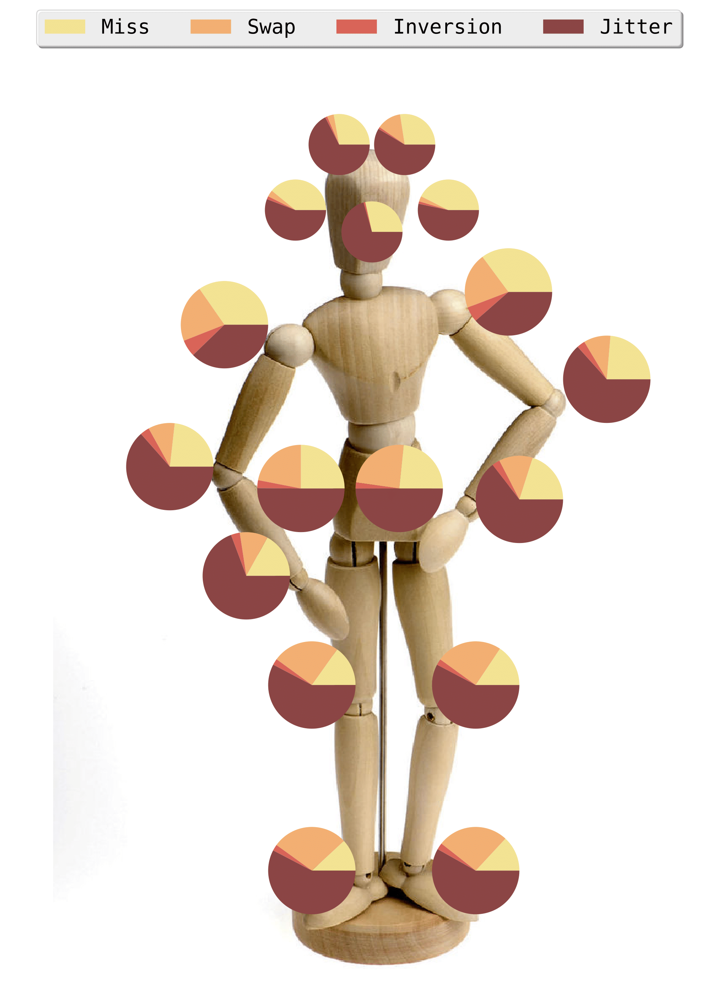

# Keypoint R-CNN

This project extends the instance-level mask preditions of [Mask R-CNN](https://github.com/matterport/Mask_RCNN) to enable keypoint estimation.

Here is a figure of the network architecture:

The architecure of the heads are as follows:

This network is trained on MS COCO with its keypoint annotations. Below is an example of such an annotation:

After training for 40k iterations, the model predicts masks such these:

Here I have visualized the heatmaps of inset (e):

I ran the evaluation from https://github.com/matteorr/coco-analyze, and it gave me the following:

Precision/Recall Curve:

Overall Keypoint Errors:

AP Improvement Areas:

Per Keypoint Error Breakdown:

